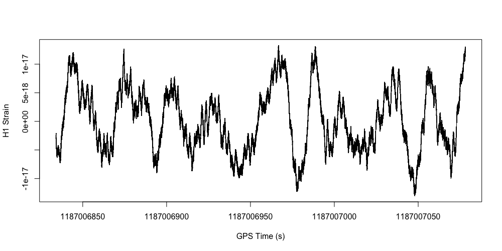

# Лабораторна робота №4

В цій лабораторній роботі побудуємо за даними детектора гравітаційних хвиль LIGO графік злиття двох нейтронних зір. Подія GW170817 https://uk.wikipedia.org/wiki/GW170817. Лабораторну роботу створено на основі https://losc.ligo.org/tutorial00/

**1. Завантажте файл з даними за посиланням https://dcc.ligo.org/public/0146/P1700337/001/H-H1_LOSC_C00_4_V1-1187006834-4096.hdf5**
```r
download.file("https://dcc.ligo.org/public/0146/P1700337/001/H-H1_LOSC_C00_4_V1-1187006834-4096.hdf5", "lab2_data1.hdf5", "auto", TRUE, mode = "wb")
```

**2. Встановить в R пакет для роботи з HDF5 файлами.**
```r
install.packages("BiocManager") 
BiocManager::install("rhdf5")
library(rhdf5)
```

**3. Виведіть зміст файлу командою h5ls().**
```r
h5ls("lab2_data1.hdf5")
```
```
                 group            name       otype  dclass      dim
0                    /            meta   H5I_GROUP                 
1                /meta     Description H5I_DATASET  STRING    ( 0 )
2                /meta  DescriptionURL H5I_DATASET  STRING    ( 0 )
3                /meta        Detector H5I_DATASET  STRING    ( 0 )
4                /meta        Duration H5I_DATASET INTEGER    ( 0 )
5                /meta        GPSstart H5I_DATASET INTEGER    ( 0 )
6                /meta     Observatory H5I_DATASET  STRING    ( 0 )
7                /meta            Type H5I_DATASET  STRING    ( 0 )
8                /meta        UTCstart H5I_DATASET  STRING    ( 0 )
9                    /         quality   H5I_GROUP                 
10            /quality          detail   H5I_GROUP                 
11            /quality      injections   H5I_GROUP                 
12 /quality/injections InjDescriptions H5I_DATASET  STRING        5
13 /quality/injections   InjShortnames H5I_DATASET  STRING        5
14 /quality/injections         Injmask H5I_DATASET INTEGER     4096
15            /quality          simple   H5I_GROUP                 
16     /quality/simple  DQDescriptions H5I_DATASET  STRING        7
17     /quality/simple    DQShortnames H5I_DATASET  STRING        7
18     /quality/simple          DQmask H5I_DATASET INTEGER     4096
19                   /          strain   H5I_GROUP                 
20             /strain          Strain H5I_DATASET   FLOAT 16777216
```

**4. Зчитайте результати вимірів. Для цього зчитайте name Strain з групи strain в змінну strain. Після зчитування не забувайте закривати файл командою H5Close().**
```r
h5f <- H5Fopen("lab2_data1.hdf5")
strain <- h5f$"/strain/Strain"
H5close()
head(strain, n = 50)
```
```
 [1] -2.391646e-18 -2.411660e-18 -2.427382e-18 -2.426351e-18 -2.427996e-18 -2.446291e-18 -2.462962e-18 -2.463456e-18
 [9] -2.464039e-18 -2.481933e-18 -2.499762e-18 -2.499653e-18 -2.499740e-18 -2.514827e-18 -2.534504e-18 -2.539017e-18
[17] -2.534552e-18 -2.547276e-18 -2.567941e-18 -2.573345e-18 -2.569082e-18 -2.580038e-18 -2.601175e-18 -2.606781e-18
[25] -2.602693e-18 -2.610871e-18 -2.633490e-18 -2.643470e-18 -2.636836e-18 -2.644074e-18 -2.664256e-18 -2.672044e-18
[33] -2.668297e-18 -2.674602e-18 -2.694475e-18 -2.704304e-18 -2.701060e-18 -2.704327e-18 -2.721023e-18 -2.736411e-18
[41] -2.734468e-18 -2.734657e-18 -2.750277e-18 -2.764038e-18 -2.762714e-18 -2.760657e-18 -2.775542e-18 -2.791775e-18
[49] -2.792872e-18 -2.789694e-18
```

**5. Також з «strain/Strain» зчитайте атрибут (функція h5readAttributes) Xspacing в змінну st та виведіть її. Це інтервал часу між вимірами.**
```r
h5f <- H5Fopen("lab2_data1.hdf5")
attrs <- h5readAttributes(h5f, "strain/Strain")
st <- attrs$Xspacing
H5close()
st
```
```
[1] 0.0002441406
```

**6. Знайдіть час початку події та її тривалість. Для цього з групи meta зчитайте в змінну gpsStart name GPSstart та в змінну duration name Duration.**
```r
h5f <- H5Fopen("lab2_data1.hdf5")
gpsStart <- h5f$"meta/GPSstart"
duration <- h5f$"meta/Duration"
H5close()
gpsStart
duration
```
```
> gpsStart
[1] 1187006834
> duration
[1] 4096
```

**7. Знайдіть час закінчення події та збережіть його в змінну gpsEnd.**
```r
gpsEnd <- gpsStart + duration
gpsEnd
```
```
[1] 1187010930
```

**8. Створіть вектор з часу вимірів і збережіть у змінну myTime. Початок послідовності – gpsStart, кінець – gpsEnd, крок – st.**
```r
myTime <- seq(gpsStart, gpsEnd, st)
head(myTime, n = 50)
```
```
[1] 1187006834 1187006834 1187006834 1187006834 1187006834 1187006834 1187006834 1187006834 1187006834 1187006834
[11] 1187006834 1187006834 1187006834 1187006834 1187006834 1187006834 1187006834 1187006834 1187006834 1187006834
[21] 1187006834 1187006834 1187006834 1187006834 1187006834 1187006834 1187006834 1187006834 1187006834 1187006834
[31] 1187006834 1187006834 1187006834 1187006834 1187006834 1187006834 1187006834 1187006834 1187006834 1187006834
[41] 1187006834 1187006834 1187006834 1187006834 1187006834 1187006834 1187006834 1187006834 1187006834 1187006834
```

**9. Побудуємо графік тільки для першого мільйону вимірів. Для цього створіть змінну numSamples, яка дорівнює 1000000.**
```r
numSamples = 1000000
numSamples
```
```
[1] 1e+06
```

**10. Побудуйте графік за допомогою функції plot(myTime[0:numSamples], strain[0:numSamples], type = "l", xlab = "GPS Time (s)", ylab = "H1 Strain")**
```r
plot(myTime[0:numSamples], strain[0:numSamples], type = "l", xlab = "GPS Time (s)", ylab = "H1 Strain")
```

